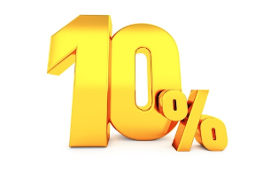

# MANGO-Datathon-2025

  
   
  Mas Diez Por Ciento

   

## What it does
Our approach makes use of state-of-the-art techniques and advanced methods to forecast the next season demand of every product planned to sale, and estimates a number for production.

## How we built it
Basically, an ensemble of multiple SOTA models for this task, including a XGBoosting, a Light-GB and a neural network (FNN). Each has been trained on a subset of the provided training data, and validated in another subset, and we brought to test the ones with best parameter combinations. An internal parameter in the training of the models acts as a crucial to trade-off to slightly favor over-production than under-production. New items in the test set never seen before can still be correctly predicted thanks to using the image embeddings in the training, which allows the model to make those forecasts based on knowledge from previous similar products. The ensemble is just doing, for each sample, an average of the predictions of each model.

## Project structure
- `src/`: training and prediction files for our multiple models in the ensemble
- `src_failed_models/`: files for the experiments that did not raise performance
- `notebooks/`: data exploration and cleaning, and some quick experiments
- `reports/`: data profiling generated for the train and test sets
- `*.csv`: the predictions for each model. Averaging them gives the final predictions.
